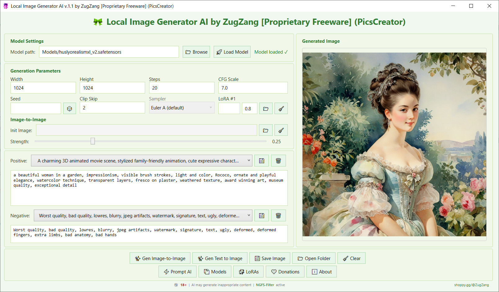

# 🖼️ PicsCreator — Local Stable Diffusion Image Generator

**PicsCreator** is a desktop WPF application (.NET 8+) that allows you to generate images using **Stable Diffusion** entirely offline on your own computer.  
It supports **SDXL**, **LoRA**, **Image‑to‑Image**, and includes a built‑in **AI prompt enhancer** (based on a local LLM) to create high‑quality prompts without manual effort.

**Love Stable Diffusion but hate ComfyUI?** That is exactly the problem PicsCreator solves. While other tools force you to wrestle with Python, CUDA, terminals, node graphs, and endless configuration files, PicsCreator offers a clean, focused interface. You don’t need to be a developer — just download, point to your model, write your prompt, and generate. No painful setup, no complex workflows, no reading GitHub issues for hours. It’s the local AI image studio for people who want results, not a second job learning the tool.

This project is designed for those who value privacy, speed, and full control over generation — everything runs locally, without cloud services.

---

## 🚀 Key Features

- **Model Loading**  
  Supports `.safetensors` (SDXL) and `.gguf` (quantized) models via `StableDiffusion.NET`.

- **Text‑to‑Image Generation**  
  Adjustable width, height, steps, CFG scale, seed, and negative prompt.

- **Image‑to‑Image**  
  Load a source image and modify it with a configurable strength slider. Dimensions are auto‑filled.

- **LoRA Support**  
  Each LoRA block has its own path and weight. The program automatically adds them to the generation parameters.

- **Preset Management**  
  Save frequently used positive and negative prompts in XML files and load them via dropdown lists.

- **Watermark**  
  The free version adds a subtle watermark with a link to the author's site; the Pro version removes it.

---

## 🖼️ Screenshots

---

## 🧰 Technology Stack

| Component | Technology |
|-----------|------------|
| Language & Platform | C#, .NET 8, WPF |
| Image Generation | [StableDiffusion.NET](https://github.com/DarthAffe/StableDiffusion.NET) (wrapper around stable‑diffusion.cpp) |
| Image Manipulation | HPPH |
| Local LLM for Prompts | LLamaSharp (wrapper around llama.cpp) + GGUF models |
| Presets | XML serialization |

---

## ⚙️ System Requirements

- OS: Windows 10 / 11 (64‑bit)
- .NET Runtime 8.0 or higher
- GPU with CUDA support (recommended 6+ GB) or CPU (slower but works)
- RAM: at least 8 GB (12+ GB recommended for SDXL)
- Free disk space: ~5–10 GB for models and LoRAs

---

## ⚙️ Installation Quick Guide:

- Install the NVIDIA latest graphics driver. (download from NVIDIA).
- Install NVIDIA CUDA 12.x (Install the required NVIDIA CUDA Toolkit version). (download from NVIDIA).
- Install NVIDIA cuDNN (Deep Neural Network library). (download from NVIDIA).
- Install .NET 8 SDK runtime/SDK components (download from Microsoft).
- Install Visual C++ Redistributable (recommended, download from Microsoft).

For AMD Radeon / Intel GPU users: the Vulkan backend should work in theory, but this has not been tested on Radeon or Intel hardware. The application will attempt to auto-detect Vulkan support. For NVIDIA owners, the steps above are fully tested and recommended.

Restart the application after installation.

---

🔞 **18+ ONLY**: PicsCreator uses AI models capable of generating mature and potentially inappropriate content depending on the selected model, LoRA, and prompt. To ensure responsible use, the application **includes a built-in NSFW Content Filter** with over 500+ terms and expressions for blocking inappropriate content, including explicit sexual material, profanity, hate speech, violence, drug, discrimination, and illegal activities.

The filter is based on the comprehensive blacklist from the **Civitai metadata lists** and has been extended with additional terms for maximum protection.

🔗 **Source**: [Civitai NSFW Filter Lists on GitHub](https://github.com/civitai/civitai/tree/main/src/utils/metadata/lists)

However, no filter is 100% foolproof. If you discover any bypasses, loopholes, or missed terms, please report them immediately. The author is committed to continuously expanding and improving the filter to ensure maximum safety for all users.

Users remain solely responsible for generated content and its use. The author assumes no responsibility for unlawful or inappropriate use of the software.

Use PicsCreator responsibly and report any gaps to help us improve!

---

## 🖥️ Usage

### Loading a Model
- Click **«Browse»** and select a model file (`.safetensors` or `.gguf`).  
- Click **«Load Model»** and wait for loading (progress is shown in the status text).

### Adjusting Parameters
- Set width, height, steps, CFG scale.  
- Optionally set a seed (leave empty for random).  
- Select up to LoRA by providing their paths and weights.  
- For Image‑to‑Image, load an initial image and adjust the **Strength** slider.

### Generation
- Enter a prompt in the **Positive** field (you can use presets or AI buttons).  
- Optionally fill the **Negative** field.  
- Press **«Gen Text to Image»** or **«Gen Image‑to‑Image»**.  
- Progress is shown on the image panel.

### Batch Generation
- In the **Count** field, enter the number of images (e.g., 5).  
- Click generate — the program will create all images, display the first one, and notify you about the saved files in the `Images` folder.

### Saving
- Click **«Save Image»** to save the current image (with watermark in the free version).  
- All images are automatically saved to the `Images` folder during batch generation.

---

## 🔒 Licensing

- **Free version**  
  - Watermark on images.  
  - Limited to 1 LoRA at a time.  
  - No batch generation.
  - No Limited, Free.

- **Pro version** (Premium)
  - No watermark.
  - Batch generation. 
  - Up to 2 simultaneous LoRAs.  
  - All AI features (Enhance, Roulette).
  - No Limited. 

To purchase a Pro key, visit [shoppy.gg/@ZugZang](https://shoppy.gg/@ZugZang).

---

## 🤝 Acknowledgments

This project uses the following libraries and tools:

- [StableDiffusion.NET](https://github.com/DarthAffe/StableDiffusion.NET) — core generation library.
- [LLamaSharp](https://github.com/SciSharp/LLamaSharp) — GGUF model integration.
- [HPPH](https://github.com/Helzburger/HPPH) — image manipulation.
- [Prompt Fungineer v2](https://huggingface.co/treadon/prompt-fungineer-v2) — prompt enhancement model (GGUF conversion by mradermacher).

Thanks to the community for these excellent tools!

---

## 📄 License

This project is distributed under a **proprietary license**.  
The source code is provided for review purposes only.  
Commercial use, modification, and redistribution without explicit permission from the author are prohibited.

See the `LICENSE` file for details.

---

## 📬 Contact

- Author: **ZugZang**  
- Website: [shoppy.gg/@ZugZang](https://shoppy.gg/@ZugZang)  

#PicsCreator #StableDiffusion #LocalAI #AIImageGenerator #ImageGeneration #TextToImage #ImageToImage #SDXL #LoRA #MultipleLoRA #BatchGeneration #PromptEnhancer #AIPrompts #LocalLLM #GGUF #CUDA #OfflineAI #PrivateAI #AI #NoSubscriptions
