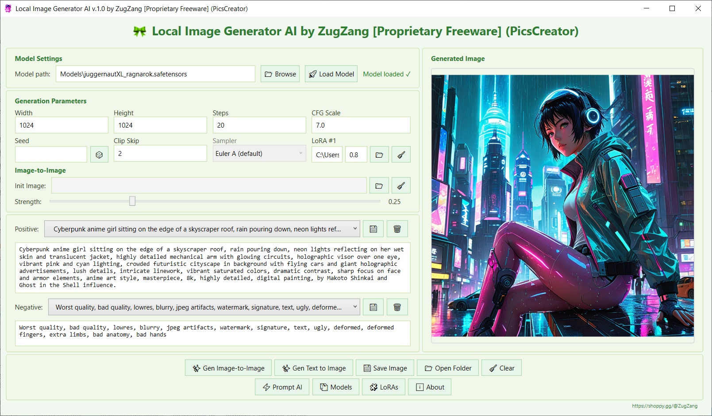

# 🖼️ PicsCreator — Local Stable Diffusion Image Generator

**PicsCreator** is a desktop WPF application (.NET 8+) that allows you to generate images using **Stable Diffusion** entirely offline on your own computer.  
It supports **SDXL**, **LoRA**, **Image‑to‑Image**, **batch generation**, and includes a built‑in **AI prompt enhancer** (based on a local LLM) to create high‑quality prompts without manual effort.

This project is designed for those who value privacy, speed, and full control over generation — everything runs locally, without cloud services.

---

## 🚀 Key Features

- **Model Loading**  
  Supports `.safetensors` (SDXL) and `.gguf` (quantized) models via `StableDiffusion.NET`.

- **Text‑to‑Image Generation**  
  Adjustable width, height, steps, CFG scale, seed, and negative prompt.

- **Image‑to‑Image**  
  Load a source image and modify it with a configurable strength slider. Dimensions are auto‑filled.

- **LoRA Support**  
  Each LoRA block has its own path and weight. The program automatically adds them to the generation parameters.

- **Preset Management**  
  Save frequently used positive and negative prompts in XML files and load them via dropdown lists.

- **Watermark**  
  The free version adds a subtle watermark with a link to the author's site; the Pro version removes it.

---

## 🖼️ Screenshots

*(Place screenshots in the `Screenshots` folder and link them here)*

---

## 🧰 Technology Stack

| Component | Technology |
|-----------|------------|
| Language & Platform | C#, .NET 8, WPF |
| Image Generation | [StableDiffusion.NET](https://github.com/DarthAffe/StableDiffusion.NET) (wrapper around stable‑diffusion.cpp) |
| Image Manipulation | HPPH |
| Local LLM for Prompts | LLamaSharp (wrapper around llama.cpp) + GGUF models |
| Presets | XML serialization |

---

## ⚙️ System Requirements

- OS: Windows 10 / 11 (64‑bit)
- .NET Runtime 8.0 or higher
- GPU with CUDA support (recommended) or CPU (slower but works)
- RAM: at least 8 GB (12+ GB recommended for SDXL)
- Free disk space: ~5–10 GB for models and LoRAs

---

## 🖥️ Usage

### Loading a Model
- Click **«Browse»** and select a model file (`.safetensors` or `.gguf`).  
- Click **«Load Model»** and wait for loading (progress is shown in the status text).

### Adjusting Parameters
- Set width, height, steps, CFG scale.  
- Optionally set a seed (leave empty for random).  
- Select up to LoRA by providing their paths and weights.  
- For Image‑to‑Image, load an initial image and adjust the **Strength** slider.

### Generation
- Enter a prompt in the **Positive** field (you can use presets or AI buttons).  
- Optionally fill the **Negative** field.  
- Press **«Gen Text to Image»** or **«Gen Image‑to‑Image»**.  
- Progress is shown on the image panel.

### Batch Generation
- In the **Count** field, enter the number of images (e.g., 5).  
- Click generate — the program will create all images, display the first one, and notify you about the saved files in the `Images` folder.

### Saving
- Click **«Save Image»** to save the current image (with watermark in the free version).  
- All images are automatically saved to the `Images` folder during batch generation.

---

## 🔒 Licensing

- **Free version**  
  - Watermark on images.  
  - Limited to 1 LoRA at a time.  
  - No batch generation.
  - No Limited, Free.

- **Pro version** (Premium)  
  - No watermark.  
  - Up to 2 simultaneous LoRAs.  
  - All AI features (Enhance, Roulette).
  - No Limited. 

To purchase a Pro key, visit [shoppy.gg/@ZugZang](https://shoppy.gg/@ZugZang).

---

## 🤝 Acknowledgments

This project uses the following libraries and tools:

- [StableDiffusion.NET](https://github.com/DarthAffe/StableDiffusion.NET) — core generation library.
- [LLamaSharp](https://github.com/SciSharp/LLamaSharp) — GGUF model integration.
- [HPPH](https://github.com/Helzburger/HPPH) — image manipulation.
- [Prompt Fungineer v2](https://huggingface.co/treadon/prompt-fungineer-v2) — prompt enhancement model (GGUF conversion by mradermacher).

Thanks to the community for these excellent tools!

---

## 📄 License

This project is distributed under a **proprietary license**.  
The source code is provided for review purposes only.  
Commercial use, modification, and redistribution without explicit permission from the author are prohibited.

See the `LICENSE` file for details.

---

## 📬 Contact

- Author: **ZugZang**  
- Website: [shoppy.gg/@ZugZang](https://shoppy.gg/@ZugZang)  

#PicsCreator #StableDiffusion #LocalAI #AIImageGenerator #ImageGeneration #TextToImage #ImageToImage #SDXL #LoRA #MultipleLoRA #BatchGeneration #PromptEnhancer #AIPrompts #LocalLLM #GGUF #CUDA #OfflineAI #PrivateAI #AI #NoSubscriptions
